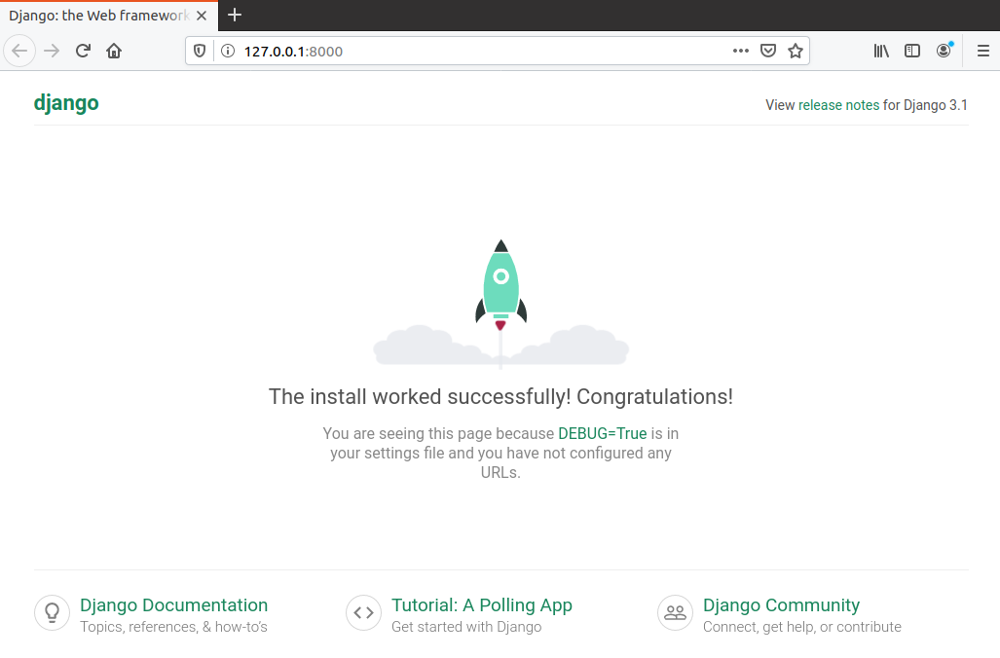
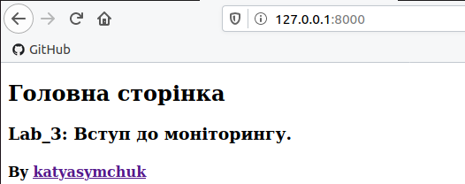
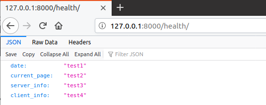
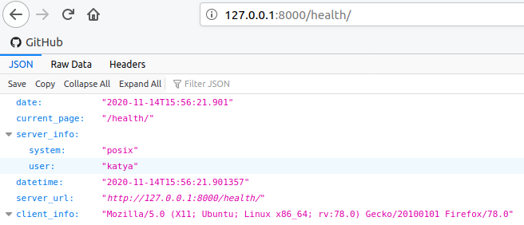

Lab_3: Вступ до моніторингу.
-
1. Створюю папку з назвою лабораторної роботи у власному репозиторію. У папці ініціалізую середовище pipenv командою `pipenv --python 3.8` та встановлюю необхідні пакети за допомогою команди `pipenv install django`.
2. За допомогою Django Framework створюю заготовку проекту командою `pipenv run django-admin startproject ks_site`. Для зручності виношу всі створені файли на один рівень вище. У результаті получається наступна структура:
    ```
    lab3/
    ├── ks_site/
    │   ├── __init__.py
    │   ├── asgi.py
    │   ├── settings.py
    │   ├── urls.py
    │   └── wsgi.py
    └── manage.py
    ```
3. Оскільки все встановлено правильно, то запускаю Django сервер, виконавши команду `pipenv run python manage.py runserver`. Переходжу за посиланням `localhost:8000`:


4. Зупиняю сервер виконавши переривання `Ctrl+C`. Добавляю файл бази даних в gitignore. Роблю коміт базового темплейту сайту. 
5. Створюю темплейт додатку (app), у якому буде описано всі web сторінки сайту за допомогою команди `pipenv run python manage.py startapp app`. Роблю коміт із новоствореними файлами темплейту додатка.
6. Використовуючи можливості IntelliJ, створюю папку `app/templates/`, файл `main.html` у цій папці та файл `app/urls.py`. Роблю коміт з даними файлами.
7. Вказую Django frameworks назву додатку та де шукати його веб-сторінки у файлах `ks_site/setting.py` та `ks_site/url.py` відповідно.
8. Заповнюю вміст файлу `app/views.py` для відображення `.html` темплейта та сторінки, що повертає відповідь у форматі JSON.
9. Заповнюю файл `app/urls.py` згідно зразка, щоб поєднати функції з реальними URL шляхами, за якими будуть доступны веб-сторінки.
10. Запускаю сервер, щоб переконатися, що сторінки доступні. Виконую коміт робочого Django сайту.


11. Встановлюю необхідну для моніторингу бібліотеку за допомогою команди `pipenv install requests`.
12. Відкриваю сторінку `/health` у браузері: 


13. Виконую задачі лабораторної роботи:
    1. модифікую функцію health так, щоб у відповіді були: згенерована на сервері дата, URL сторінки моніторингу, інформація про сервер, на якому запущений сайт та інформація про клієнта який робить запит до сервера:
    
    2. дописую функціонал який буде виводити повідомлення про недоступність сайту у випадку якщо WEB сторінка недоступна:
    3. роблю так, щоб програма моніторингу запускалась раз в хвилину та працювала в бекграунді. Запускаю моніторинг, результати якого запусуються в файл `server.log`:
        ```
        python3 monitoring.py &
        ```
    4. додаю аліас на запуск сервера, який можна буде запускати командою `pipenv run server`, та аліас на запуск моніторингу командою `monitoring`.
14. Запускаю сервер та переконуюся, що головна сторінка відображається. У іншому вікні терміналу запускаю моніторинг. Комічу файл логів `server.logs` до репозиторію.
