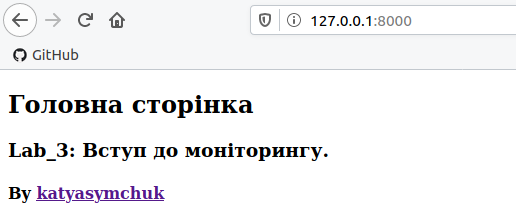
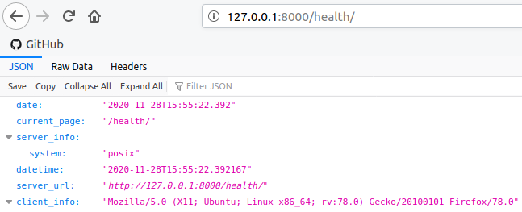

#Lab_4: Робота з Docker.

## Pre-requirements:
- інсталюю `Docker` на віртуальну машину Ubuntu.

## Хід роботи
1.Ознайомлююся з документацією `Docker`.
2. Для перевірки чи `Docker` встановлений правильно, на віртуальній машині запускаю команду для виведення версії, допомоги та запускаю тестовий `image`: 
    ```
    docker -v 
    docker --help
    docker run docker/whalesay cowsay Docker is fun 
   ```
    Результати виконання команд перенаправляю у файл `my_work.log` та комічу його до репозиторію. Для цього використовую оператори перенапрвлення потоку виводу`>` i `>>`.
3. `Docker` працює з Імеджами та Контейнерами. Ознайомлююся з документацією Dockerfile, який описує контент імеджу.
4. Для знайомства з `Docker` створюю імедж із `Django` сайтом зробленим у попередній робот:
    - Оскільки проект на `Python`, то і базовий імедж також вибираю відповідний. Всі імеджі можна знайти на `Docker Hub`. Використoвую команди, щоб завантажити базовий імедж з репозиторію:
    ```
    docker pull python:3.8-slim
    docker images
        REPOSITORY          TAG                 IMAGE ID            CREATED             SIZE
        python              3.8-slim            1a3aefdc4d38        3 days ago          113MB
        docker/whalesay     latest              6b362a9f73eb        5 years ago         247MB
    docker inspect python:3.8-slim
    ```
    - Створюю файл з іменем `Dockerfile` та скопіюю туди вміс такого ж файлу з репозиторію `devops_course`;
    - Ознайомлююся із коментарями, щоб зрозуміти структуру написання `Dockerfile`;
    - Замінюю посилання на власний `Git` репозиторій із моїм веб-сайтом та комічу даний `Dockerfile`.
5. Створюю власний репозиторій на `Docker Hub`. Для цього заходжу у власний аккаунт на `Docker Hub`, переходжу у вкладку `Repositories` і далі натискаю кнопку `Create new repository`. Даю назву репозиторію `lab4_django`.
6. Виконую білд (build) `Docker image` та завантажую його до створеного репозиторію(до цьго обов'язково логінюся через термінал). Для цього вказую назву та TAG. Оскільки мій репозиторій `katyasymchuk/lab4_django` то команда буде виглядати:
    ```
    docker build -t katyasymchuk/lab4_django -f Dockerfile .
    docker images
        REPOSITORY                 TAG                 IMAGE ID            CREATED             SIZE
        katyasymchuk/lab4_django   latest              9d3ade4e5f0a        18 seconds ago      336MB
        python                     3.8-slim            1a3aefdc4d38        3 days ago          113MB
        docker/whalesay            latest              6b362a9f73eb        5 years ago         247MB
   docker tag katyasymchuk/lab4_django katyasymchuk/lab4_django:django
   docker push katyasymchuk/lab4_django:django
    ``` 
    - [Посилання на мій Docker Hub репозиторій](https://hub.docker.com/repository/docker/katyasymchuk/lab4_django);
    - Назва імеджа: `katyasymchuk/lab4_django:django`.
7. Запускую веб-сайт командою:
    ```
    docker run -it --name=django --rm -p 8000:8000 katyasymchuk/lab4_django:django
    ```
    - Переходжу на адресу `http://127.0.0.1:8000`, щоб переконатися що дві сторінки веб-сайту працюють:
    
    