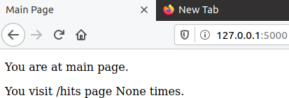
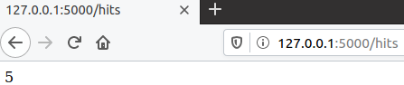
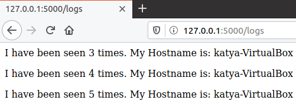

#Lab_5: Автоматизація за допомогою Makefile VS Docker Compose

## Pre-requirements:
- Інсталюю `Docker/docker-compose, make` на віртуальну машину Ubuntu

## Хід роботи
1. Ознайомлююся з документацією `docker-compose`.
2. Переглядаю документацію `Flask` для створення простого веб-сайту на Python.
3. Створюю папку `my_app`, у якій буде знаходитись проект. Створюю папку `tests`, де будуть тести на перевірку працездатності проекту. Копіюю файли з репозиторію `devops_course` у відповідні папки мого репозиторію. Ознайомлююся із вмістом кожного з файлів. Переглядаю файл `requirements.txt` у папці проекту та тестах. Це файл містить залежності додатку, які необхідно встановити. Ознайомлююся з вмістом кожного файлу.
4. Перевіряю чи проект є працездатним, перейшовши у папку та після ініціалізації середовища виконую наступні команди:
    ```
    pipenv --python 3.8
    pipenv install -r requirements.txt
    pipenv run python app.py
    ```
    - Виправляю помилку `redis.exceptions.ConnectionError`, що виникла при спробі запустити додаток, встановлюю `redis-server` та роблю зміни у конфігураційному файлі `/etc/redis/redis.conf`. Після цього програма працює коректно:
    
        
     
    - Ініціалузую середовище для тестів у іншій вкладці терміналу та запускаю їх командою:
      ```
      pipenv run pytest test_app.py --url http://localhost:5000
      ```
    
    - Для того, щоб тести працювали створюю папку `logs` і лог-файл `app.log` у папці з додатком. Після цього тести проходять успішно:

    - Перевіряю роботу сайту, перейшовши на кожну із сторінок:
    
        
        
        
      
    - Видаляю всі файли, що створились в процесі запуску (Pipfile, Pipfile.lock);