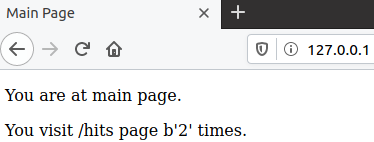
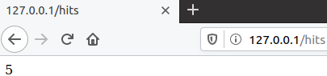
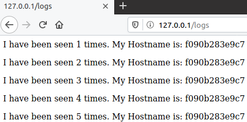
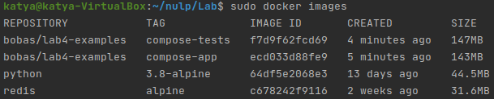

#Lab_5: Автоматизація за допомогою Makefile VS Docker Compose

## Pre-requirements:
- Інсталюю `Docker/docker-compose, make` на віртуальну машину Ubuntu

## Хід роботи
1. Ознайомлююся з документацією `docker-compose`.
2. Переглядаю документацію `Flask` для створення простого веб-сайту на Python.
3. Створюю папку `my_app`, у якій буде знаходитись проект. Створюю папку `tests`, де будуть тести на перевірку працездатності проекту. Копіюю файли з репозиторію `devops_course` у відповідні папки мого репозиторію. Ознайомлююся із вмістом кожного з файлів. Переглядаю файл `requirements.txt` у папці проекту та тестах. Це файл містить залежності додатку, які необхідно встановити. Ознайомлююся з вмістом кожного файлу.
4. Перевіряю чи проект є працездатним, перейшовши у папку та після ініціалізації середовища виконую наступні команди:
    ```
    pipenv --python 3.8
    pipenv install -r requirements.txt
    pipenv run python app.py
    ```
    - Виправляю помилку `redis.exceptions.ConnectionError`, що виникла при спробі запустити додаток, встановлюю `redis-server` та роблю зміни у конфігураційному файлі `/etc/redis/redis.conf`. Після цього програма працює коректно:
    
        
     
    - Ініціалузую середовище для тестів у іншій вкладці терміналу та запускаю їх командою:
      ```
      pipenv run pytest test_app.py --url http://localhost:5000
      ```
    
    - Для того, щоб тести працювали створюю папку `logs` і лог-файл `app.log` у папці з додатком. Після цього тести проходять успішно:

    - Перевіряю роботу сайту, перейшовши на кожну із сторінок:
    
        
        
        
      
    - Видаляю всі файли, що створились в процесі запуску (Pipfile, Pipfile.lock);

## Makefile
1. Створюю два Dockerfile та Makefile, який допоможе автоматизувати процес розгортання.
2. Ознайомлююся із вмістом Dockerfile та Makefile та його директивами:
   - `STATES` і `REPO` - змінні які містять назви тегів та назву Docker Hub репозиторію відповідно;
   - `.PHONY` - утиліта `make`, яка вказує файлу, що переліченні нище цілі не являються файлами;
   - `$(STATES)` - ціль, призначення для білду контейнера;
   - `run` - ціль, призначення для створення мережі, у якій буде працювати додаток; запуску додатку і сховища `redis`;
   - `test-app` - ціль для запуску тестів;
   - `docker-prune` - ціль для очистки ресурсів, що бути використанні при роботі `Docker`.

3. Створюю Docker імеджі для додатку та для тестів виконавши команду:
    ```
    make .PHONY
    ```
6. Запускаю додаток та тести в різних терміналах:
    ```
    make run
    make test-app
    ```
   - Запускаю тести та бачу, що всі виконалися успішно:
   
      
     
   - Перевіряю роботу кожної сторінки веб-сайту:
   
      
      
      
      
      
7. Зупиняю додаток, натиснувши `Ctrl+C`, та очищаю всі ресурси Docker за допомогою команди:
    ```
    make docker-prune
    ```
8. Створюю директиву в `Makefile` для завантаження створених імеджів у Docker Hub репозиторій. Завантажую імеджі до репозиторію `katyasymchuk/lab5_devops` командою:
    ```
    make push
    ```
   - [Посилання на мій Docker Hub репозиторій](https://hub.docker.com/repository/docker/katyasymchuk/lab5_devops);

9. Видаляю створені та завантаженні імеджі. Створюю директиву `delete-images` в `Makefile`, яка автоматизує процес видалення імеджів. Виконую директиву та перевіряю коректність її роботи:
   ```
   make delete-images
   ```
   

##Docker-compose
1. Створюю файл `docker-compose.yaml` у кореновій папці проекту та заповнюю вмістом згідно прикладу. У цій реалізації розгортання є дві мережі:
   - У мережі `secret` знаходяться `app` і `redis`. Отстанній не має доступу до зовнішніх ресурсів;
   - До мережі `public` відносяться `app` і `tests`. Таким чином `tests` i `redis` не мають доступу один до одного.

2. Перевіряю чи Docker-compose встановлений та працює у моїй системі, а далі просто запускаю `docker-compose`:
   ```
   docker-compose version
      docker-compose version 1.27.4, build 40524192
      docker-py version: 4.3.1
      CPython version: 3.7.7
      OpenSSL version: OpenSSL 1.1.0l  10 Sep 2019
   docker-compose -p lab5 up
   ```
   
3. Перевіряю чи працює веб-сайт. Для цього переходжу за адресою `http:/127.0.0.1/`:

   

   

   

4. Перевіряю чи компоуз створив докер імеджі . Імеджі мають назви `compose-tests` і `compose-app`. Змінюю їх на власний репозиторій `katyasymchuk/lab5_devops` і перезапускаю `docker-compose`, очистивше імеджі без тегів за допомогою директиви в `Makefile`, яку я створила раніше:

   

5. Зупиняю проект, натиснувши `Ctrl+C`, і очищаю ресурси створені компоуз `docker-compose down`.

6. Завантажую створені імеджі до `Docker Hub` репозиторію за допомогою команди:
    ```
    docker-compose push
    ```
7. Я думаю, що `docker-compose.yaml` і `Makefile` мають свої сфери використання в залежності від потреб проєкту:
   - `Makefiles` є інструментом збирання, принцип якого простий: для побудови цілі необхідно вказати залежності та команди для її побудови. Однак він має дещо важчу реалізацію і при роботі з багатьма `docker` контейнерами можуть виникнути складнощі;
   - За допомогою `docker-compose` можна визначити багатоконтейнерну структуру в одному файлі та працювати з мікросервісною архітектурою, виконуючи прості команди, які роблять усе необхідне для її запуску, зупинки і деплою.

##Домашнє завдання
1. Створюю `docker-compose.yaml` для лабораторної №4:

   - За допомогою `docker-compose.yaml` створюється два імеджі для Django сайту та моніторингу [docker-compose.yaml файл]();

   - Запускаю `docker-compose.yaml` командою
       ```
       docker-compose -p lab4 up
       ```
   - Перевіряю доступність головної сторінки та вкладки `health`:

   

   

   - Зупиняю проект, натиснувши `Ctrl+C`, і очищаю ресурси створені компоуз `docker-compose down`;

   - Завантажую створені імеджі до `Docker Hub` репозиторію за допомогою команди ([Посилання на Docker Hub репозиторій для 4 лабораторної](https://hub.docker.com/repository/docker/katyasymchuk/lab4_django)):
        ```
        docker-compose push
        ```