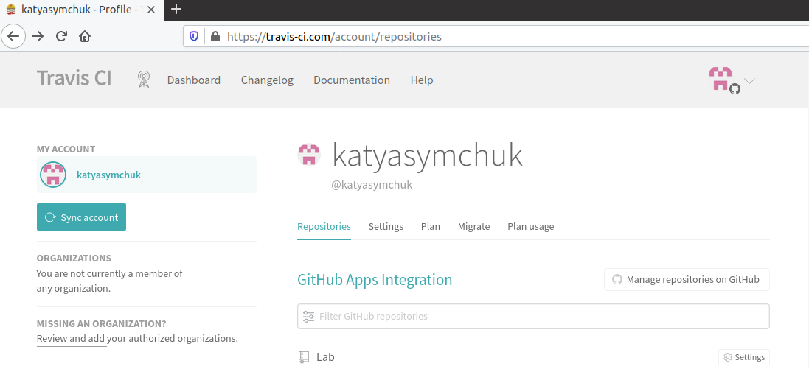

# Lab_6: Автоматизація за допомогою CI/CD серверів

## Pre-requirements:
- Реєструю обліковий запис на сайті `Travis`;

## Хід роботи
1. Виконую вхід за допомогою GitHub креденшалів і погоджуюся з дозволами, які вимагає `Travis` для даного репозиторію.
2. Ознайомлююся з документацією по Travis CI.
3. Перевіряю чи вибраний під час реєстрації репозиторій відображається в `Travis`:

   

4. Для того, щоб `Travis` знав, які кроки потрібно виконати над кодом, у кореневій папці репозиторію створюю файл `.travis.yaml` та копіюю туди вміст з репозиторію `devops_course`. `Travis` повинен автоматично знайти даний файл та виконувати кроки, описані у ньому, при кожному новому коміті в `main` гілку.
5. Для налаштування інтеграції з `Docker Hub`, створюю змінні середовища для авторизації.
6. Дописую у файлі `.trivis.yml` усі попередні домашні завдання:
   - переписую білд lab 2, з використання кроків записаних у `Makefile`;
   - переписую білд lab 4, з ще одним `Dockerfile` для контейнера моніторингу;
   - переписую білд lab 5 і додаю кроки `Makefile`, які робили push імеджів у `Docker Hub` репозиторій;